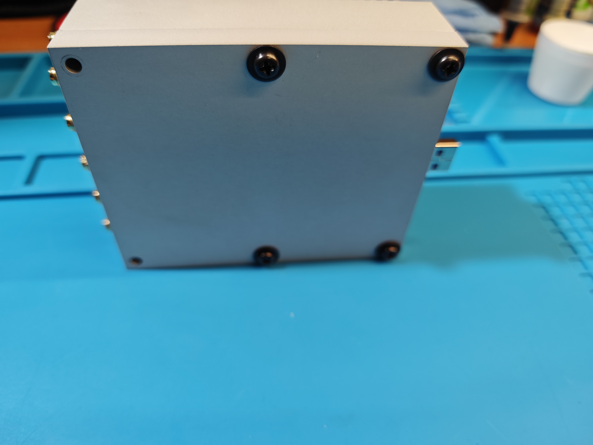
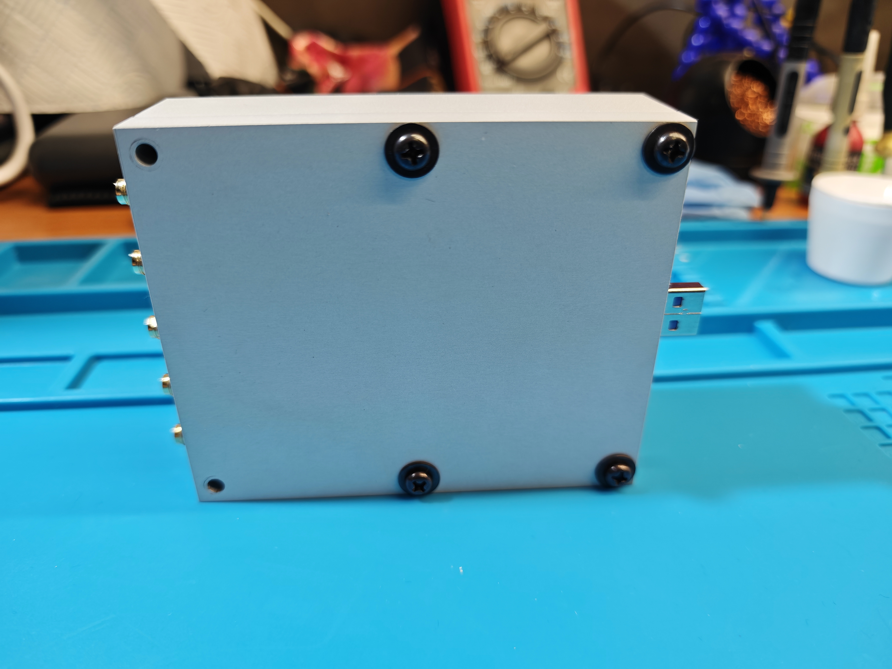
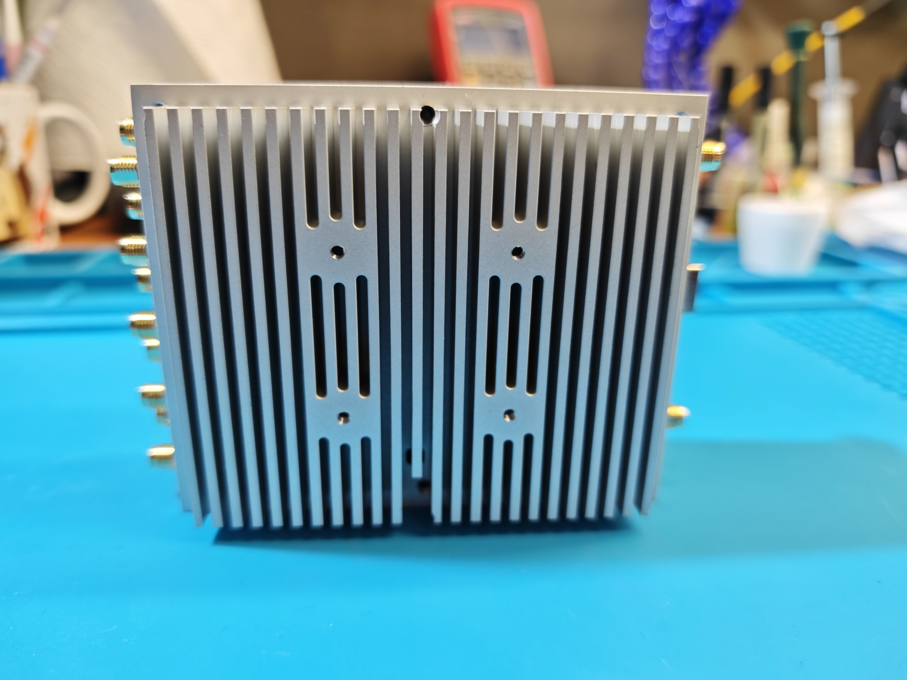
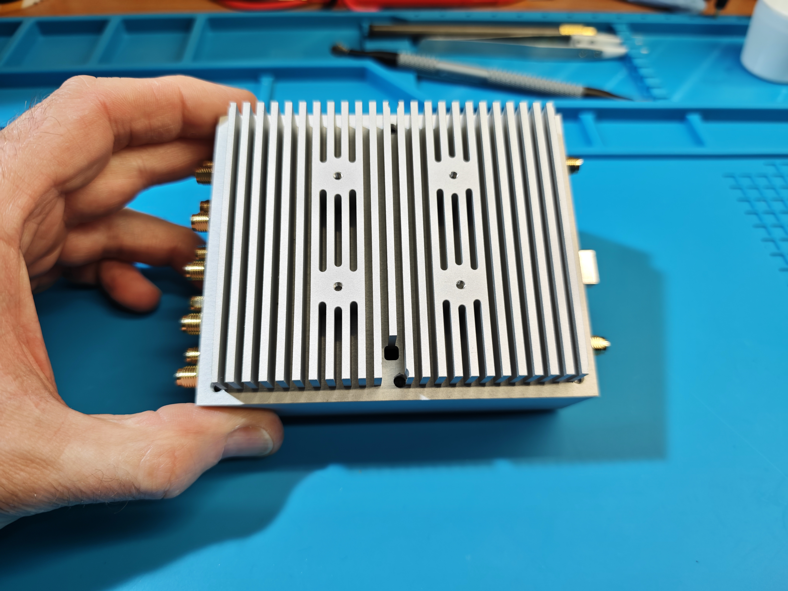
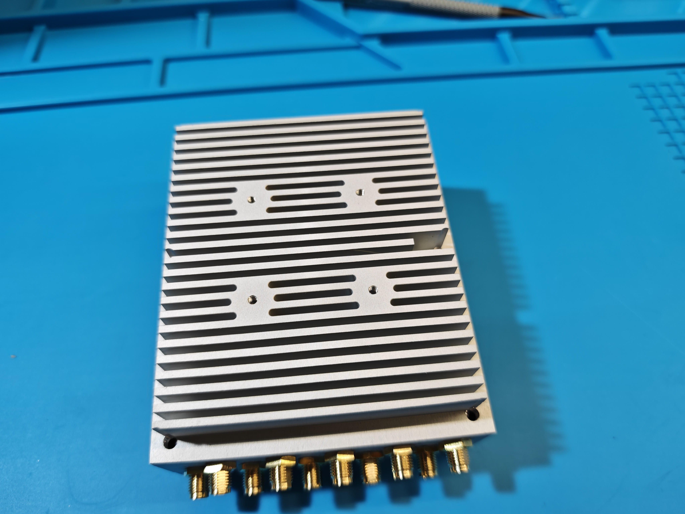
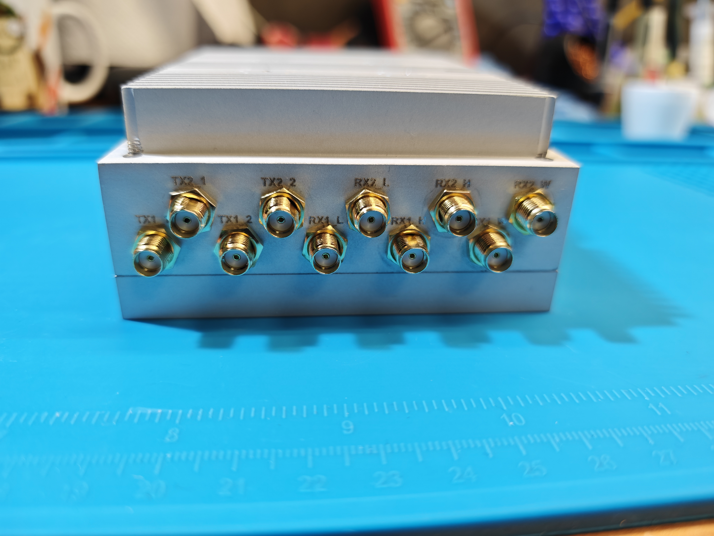

# LimeSDR USB RF-Shielded CNC Case

A two-part aluminum enclosure for **LimeSDR USB** focused on:

- mechanical protection,
- efficient passive cooling,
- RF section shielding with separated RF/control zones.

## Why this project exists

After buying LimeSDR USB, I found that the only ready-made heatsink case with full SMA breakout was Lime AC Tetra Case.  
However, it does not separate RF and control areas despite the firewall concept present on the board.

I ordered that case through Crowd Supply, paid, and waited for two months, but shipping was repeatedly postponed.  
After refunding the order, I designed and tested this case myself.

## Design goals

- Protect LimeSDR USB mechanically for daily bench and field usage.
- Improve heat transfer from high-dissipation components to the enclosure.
- Preserve/extend RF shielding strategy with dedicated firewall geometry.
- Keep the design manufacturable by common CNC services (tested with JLCCNC).

## Thermal design notes

- Thermal transfer pads are provided for the main hot components.
- One support/thermal island is placed on the PCB bottom side to support heat removal in the RF chip area.
- The case is designed for **1.0 mm thermal interface pads** (soft thermopad recommended).
- Depending on location, compressed pad deflection is roughly **0.4 to 0.7 mm**.

> Use a **soft thermopad** to avoid PCB stress or damage.

## Fan support

- Top surface has a mounting area for **4010 fan (40x40x10)**.
- Includes a **6 mm cable access hole** to route fan wires to the onboard LimeSDR fan header.
- LimeSDR fan output is **3.3 V** and not intended for high current.

Passive cooling has been sufficient in my receive-only usage; observed temperature stayed near **34C** without a fan.

## Cable recommendations

RF side (SMA-IPEX):

- Recommended: **RG113**, length **75 mm**
- Quantity: **10 pcs** for RF ports
- Avoid RG178 here (too stiff; risks damaging IPEX connectors)
- 100 mm on RF side can work, but also makes enclosure assembly noticeably harder

Clock side (CLOCK IN/OUT):

- RG178 is acceptable, **75 to 100 mm**
- 100 mm works but makes enclosure assembly noticeably harder

## Fasteners and assembly

- Case halves: **M4x30**
  - Threads are **not** pre-modeled in the CAD files
  - User should tap threads in the top half during assembly
  - Bolts inserted from bottom
  - Bolt heads act as enclosure feet
- LimeSDR PCB mounting: **M3x4, flat head required**
- Fan mounting: **M2.5 or M3**
  - Holes are modeled for M2.5 and can be tapped to M3 if needed

## Manufacturing experience

Pilot build was ordered from **JLCCNC**.

- CNC + sandblasting + anodizing + laser marking: **$233.06** (shipping excluded)
- SMA-IPEX cables (AliExpress): **EUR 6.42**

Typical flow:

1. Upload `top.step` and `bottom.step`
2. If port engraving is needed, enable laser marking option and upload `Laser_Marking.dwg`
3. Wait for engineering review and quotation
4. Pay and wait for production (my case took ~10 days)

## Revisions after pilot build

After receiving and testing, the design was updated:

- Increased lower-half PCB lip for **1.7 mm PCB thickness** (instead of 1.6 mm)
- Extended RF side to improve connector and screw clearance
- Shortened heatsink fins to reduce machining cost
- Increased top ceiling thickness in CPU/control area

## Files in this repository

- `top.step`
- `bottom.step`
- `top.f3d`
- `bottom.f3d`
- `Laser_Marking.dwg`
- `images/` (pilot build photos)

## Photos

Pilot photos (full set is available in `images/`):

## License

This project is licensed under **Creative Commons Attribution-NonCommercial 4.0 International (CC BY-NC 4.0)**.

- You may use, copy, and modify the design.
- Commercial use and resale are not allowed without separate permission.
- See `LICENSE` for full terms.

